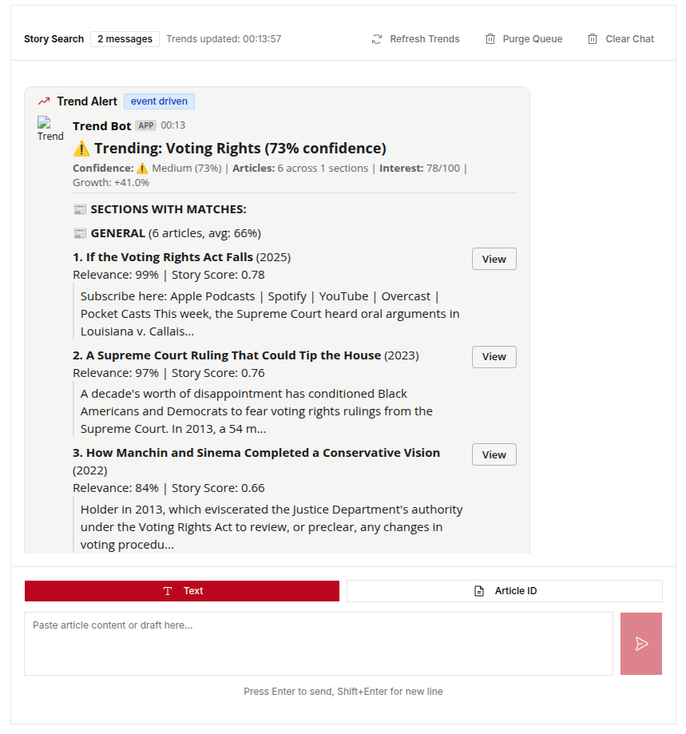
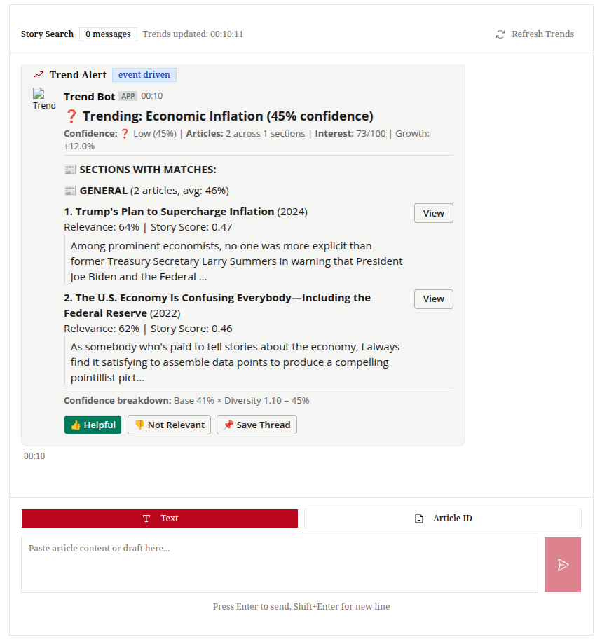
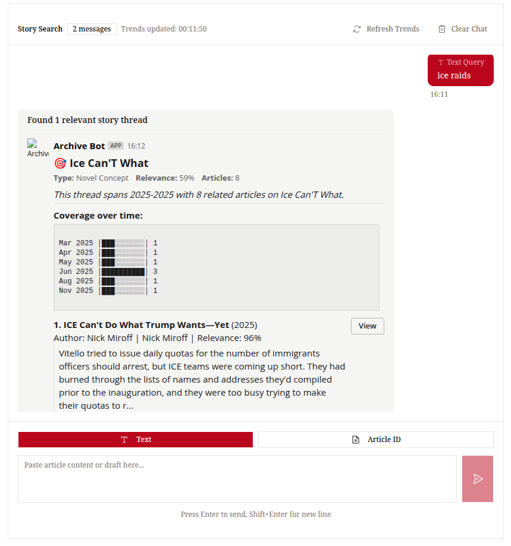
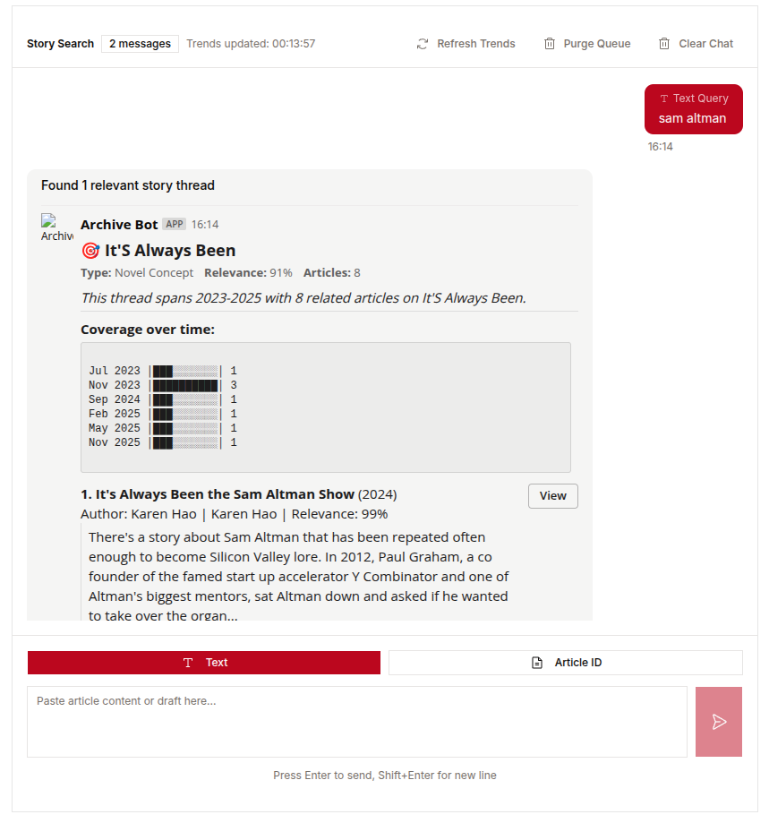

# Slackbot integration

We also output in Slack's format for a Slack Bot if you don't want to use the tool directly.

A bot can print out new trends identified like so:

Users can also talk to the bot to get specific topic searches in the archive:

